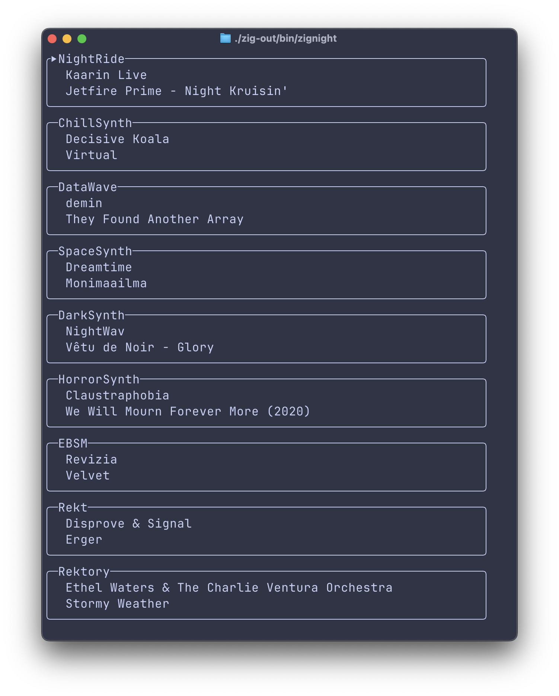

# zignight
Nightride FM radios in your terminal !

- All radio stations directly accessible from the terminal
- No need for extra audio players

# Build & Installation
The program only compiles with Zig 0.14.1

- Download the approriate Zig compiler on the [download page](https://ziglang.org/download/)
- Run `zig build -Doptimize=ReleaseFast`
- You'll find the binary in `zig-out/bin` folder
- Copy it somewhere in a folder inside your PATH environnement
